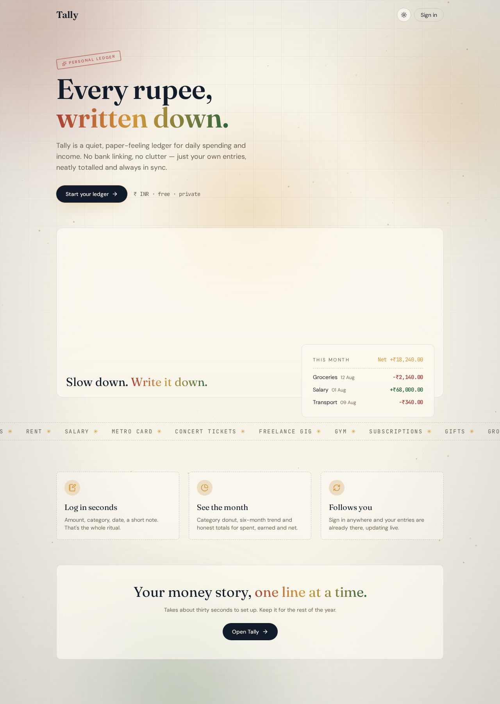
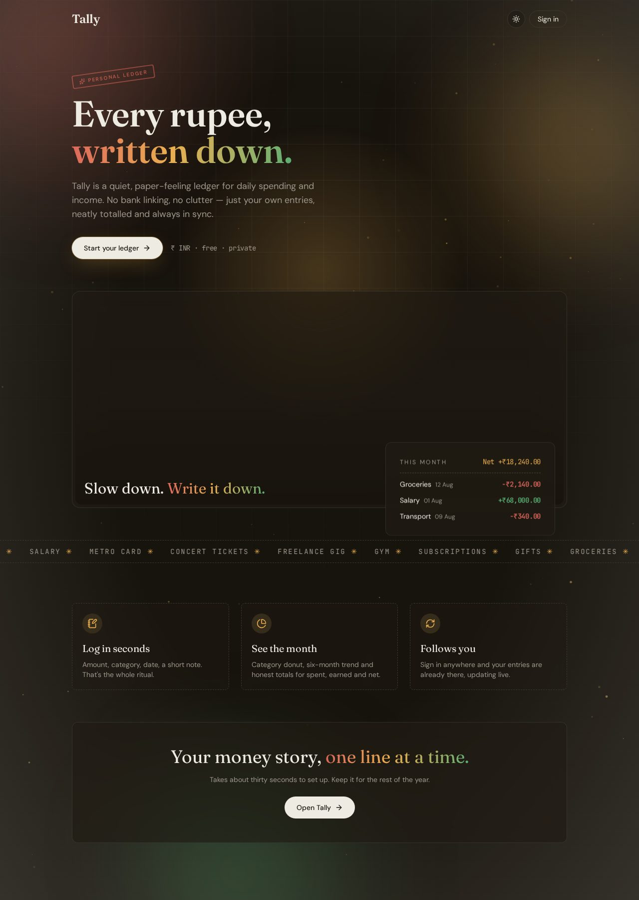

# Tally — Every rupee, written down.

<p align="center">
  
</p>

<p align="center">
  <strong>A calm, paper-feeling ledger for your daily expenses and income.</strong><br/>
  No bank linking. No clutter. Just your own entries, neatly totalled and always in sync.
</p>

<p align="center">
  
  
  
  
  
  
</p>

---

## Preview

| Light | Dark |
| --- | --- |
|  |  |

---

## Why Tally

Most money apps feel like a quarterly board meeting. Tally feels like a notebook you
actually enjoy opening: warm paper tones, a characterful serif, tabular monospace
numbers, and a little motion where it earns its place.

## Features

- **Two-tap logging** — amount, type, category, date, optional note.
- **Monthly view** — step month to month; totals for spent, earned and net with
  animated count-ups.
- **Charts** — a category donut and a six-month income-vs-expense trend.
- **Live sync** — entries update in realtime across every signed-in device.
- **CSV export** — take the current month with you, any time.
- **Light & dark themes** — remembers your choice, follows your system on first visit,
  applies before first paint so there's no flash.
- **Motion, tastefully** — drifting mesh background with gold paper specks, a
  pointer-tracked spotlight, a 3D-tilting receipt card, a cinematic hero video and
  scroll reveals. All of it stills itself under `prefers-reduced-motion`.
- **Private by design** — row-level security means every row is scoped to its owner.

## Tech stack

| Layer | Choice |
| --- | --- |
| Framework | TanStack Start v1 (React 19, SSR, file-based routing) |
| Build | Vite 7 |
| Styling | Tailwind CSS v4 (CSS-first tokens in `src/styles.css`) |
| UI | shadcn/ui + Radix primitives, Lucide icons |
| Motion | Motion for React |
| Charts | Recharts |
| Data & auth | Supabase (Postgres, RLS, Google + email auth, realtime) |
| Server logic | TanStack server functions |

**Typography:** Fraunces (display) · DM Sans (body) · JetBrains Mono (money).

## Data model

```sql
transactions (
  id          uuid primary key,
  user_id     uuid not null references auth.users,
  type        text check (type in ('expense','income')),
  amount      numeric not null,
  category    text not null,
  occurred_on date not null,
  note        text,
  created_at  timestamptz default now()
)
```

Row-level security restricts every `select / insert / update / delete` to
`auth.uid() = user_id`.

## Project structure

```text
src/
  routes/
    __root.tsx                  app shell, fonts, theme script, background
    index.tsx                   landing page (hero video, marquee, features)
    auth.tsx                    sign in / sign up / reset
    _authenticated/
      route.tsx                 auth gate
      dashboard.tsx             month view, summary, charts, ledger
  components/
    LedgerBackground.tsx        mesh gradients + spotlight + canvas specks
    CategoryDonut.tsx           category breakdown
    TrendChart.tsx              six-month trend
    LedgerList.tsx              perforated transaction list
    EntryDialog.tsx             add / edit / delete entry
    CountUp.tsx  ThemeToggle.tsx  Footer.tsx
  lib/
    categories.ts  tally.ts  theme.ts
```

## Running locally

```sh
git clone <this-repository-url>
cd tally
npm install
npm run dev          # http://localhost:8080
```

Create a `.env` with your backend credentials:

```sh
VITE_SUPABASE_URL=...
VITE_SUPABASE_PUBLISHABLE_KEY=...
VITE_SUPABASE_PROJECT_ID=...
```

Other scripts: `npm run build`, `npm run preview`, `npm run lint`, `npm run format`.

## Shipped

- **Monthly budgets** — per-category caps with animated progress rings and an 80% nudge
- **Streaks & milestones** — 21-day heat strip, best-streak tracking and confetti on a surplus month
- **Quick add** — type `chai 40` or `+salary 68000` and Tally files it for you
- **Recurring entries** — rent, salary and subscriptions post themselves each month
- **Year in review** — story-style recap with top categories, best month and a share button
- **Installable PWA** — add Tally to your home screen; the shell works offline

## Roadmap

- Multi-currency ledgers
- Shared/household ledgers
- Receipt photo attachments


## License

MIT.

---

<p align="center">
  Built by <a href="https://github.com/Abhirai2006"><strong>Abhirai2006</strong></a>
</p>
